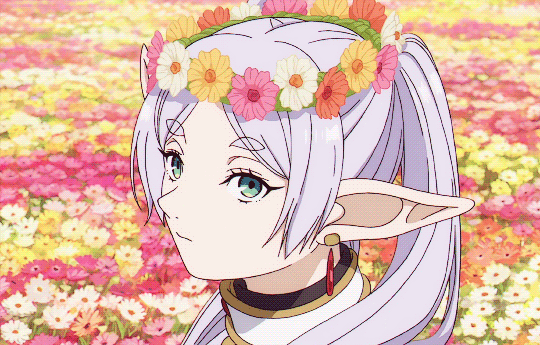

<div align="center">
  <picture>
    <source align="top" media="(prefers-color-scheme: dark)" srcset="https://readme-typing-svg.herokuapp.com/?font=Fira+Code&pause=1000&color=00FFFF&multiline=true&random=false&width=435&center=true&lines=Hello+do+you+like+Frieren+?">
    
  </picture>
</div>


##  About me


```python
git_owner = TMCooper()

def TMCooper():
  name = "TMCooper",
  love =[🌸- Manga,
          🌸- Anime
          🌸- Gaming]
  return TMCooper

print(git_owner)
```


##  Statistics </a>


<source
    srcset="https://streak-stats.demolab.com/?user=TMCooper&theme=blueberry-duo&hide_border=true&border_radius=5&locale=fr&mode=weekly&card_height=215"
    media="(prefers-color-scheme: dark)"
    width="49%"
  />
  <source
    srcset="https://github-readme-stats.vercel.app/api/wakatime?username=TMcooper&layout=compact&langs_count=10&theme=radical&custom_title=Time%20by%20language%20since%2002/11/2024"
    media="(prefers-color-scheme: dark)"
    width="49%"
  />
</picture>

##  Skills

###  Outils
<div align="center">
  
</div>

###  Languages
<div align="center">
  
</div>

###  IDE
<div align="center">
  
</div>
  


<!-- a ajouter les nouvelle image et pourquoi pas pour un genre de cool down qui change toute les 5mn ou quelque chose du genre pour pouvoir avoir une variation de gif et de l'image qui vont y être ajouter-->
