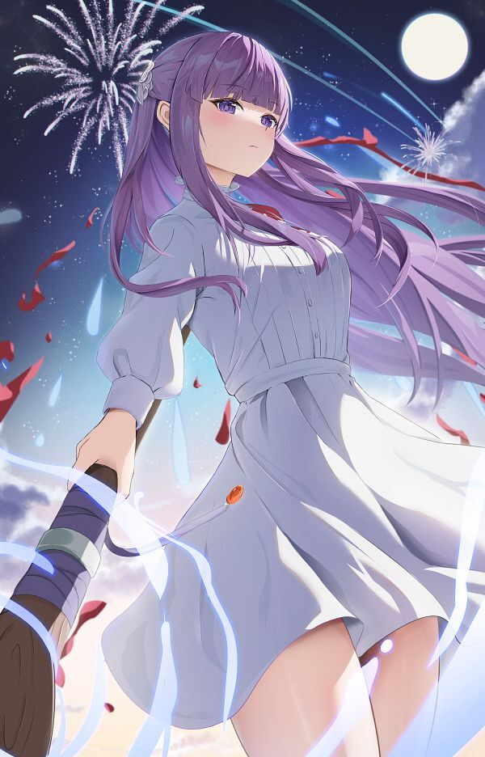

  
  <picture>
    <source align="top" media="(prefers-color-scheme: dark)" srcset="https://readme-typing-svg.herokuapp.com/?font=Fira+Code&pause=1000&color=00FFFF&multiline=true&random=false&width=435&center=true&lines=Hello+do+you+like+Frieren+?">
    
  </picture>
  

    
 <pre align="center">
    🌸- Manga 
    🌸- Anime
  </pre>
      

##  Statistics </a>

    
</picture>

##  Skills

###  Outils

  

###  Languages

  

### IDE

  

